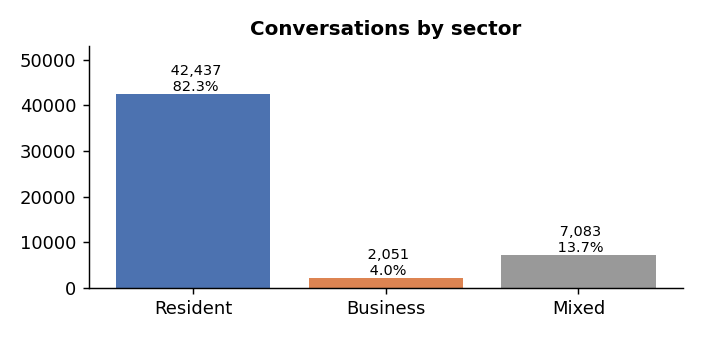
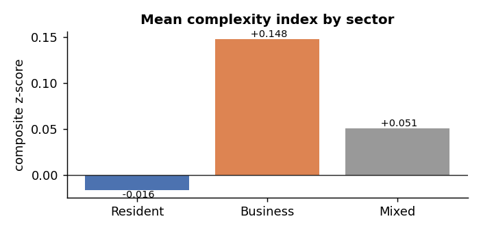
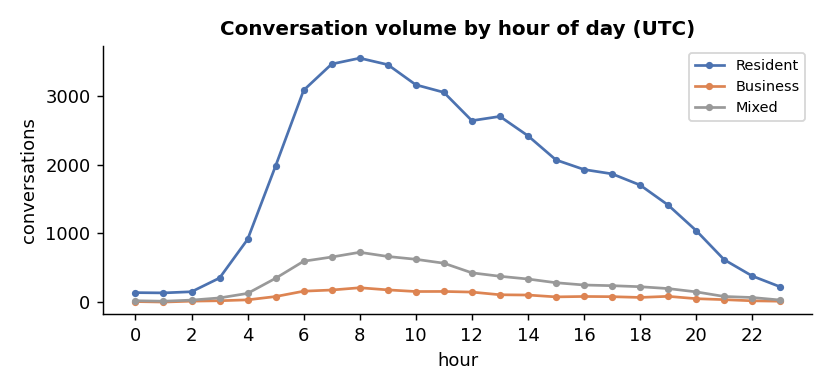
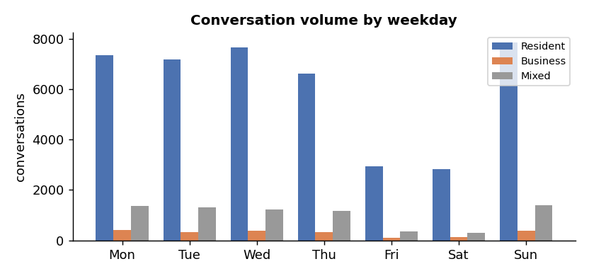
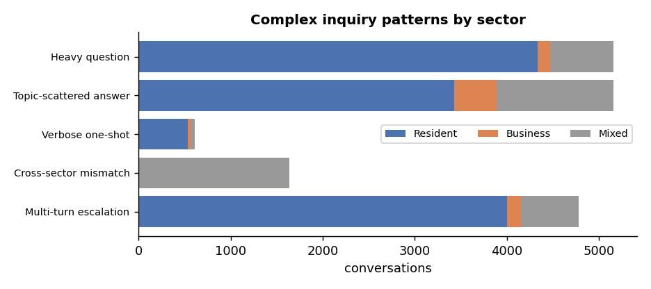

# Sector Analysis Report

Source: `topic_distribution.csv` + `Engdata(usage_binatanya_01-03-25_16-11-).csv`  |  **51,571 conversations**  |  date range 2025-03-01 - 2025-11-16.

## 1. Sector assignment

Each conversation's dominant LDA topic on each side is mapped to a sector via the provided `USER_TOPIC_SECTOR` / `AGENT_TOPIC_SECTOR` maps. The two sides are then resolved into one `sector`: **agree -> that sector; one side Mixed -> take the more specific other side; Resident vs Business conflict -> Mixed**.

| sector | conversations | share |
|---|---|---|
| Resident | 42,437 | 82.3% |
| Business | 2,051 | 4.0% |
| Mixed | 7,083 | 13.7% |

## 2. Complexity by sector

Complexity per conversation combines four signals: number of turns, question length, answer length (all log-compressed) and answer **topic entropy** (how spread the answer is across the 15 agent topics). The `complexity_index` is the mean of their z-scores - 0 is dataset average, positive is more complex.

| sector | conversations | mean_turns | mean_q_words | mean_a_words | mean_entropy | complexity_index | thumbs_down_rate |
|---|---|---|---|---|---|---|---|
| Resident | 42437 | 1.857 | 16.458 | 257.655 | 0.234 | -0.016 | 1.2% |
| Business | 2051 | 1.75 | 14.304 | 338.636 | 0.312 | 0.148 | 0.7% |
| Mixed | 7083 | 1.85 | 16.44 | 189.501 | 0.338 | 0.051 | 1.2% |

## 3. Sector-based time analysis

Conversations span 2025-03-01 to 2025-11-16. Peak hour (UTC): **Resident** 08:00, **Business** 08:00, **Mixed** 08:00.

Volume by hour of day (UTC):

| hour | Resident | Business | Mixed |
|---|---|---|---|
| 0 | 138 | 8 | 20 |
| 1 | 134 | 1 | 13 |
| 2 | 151 | 14 | 29 |
| 3 | 351 | 20 | 61 |
| 4 | 913 | 33 | 127 |
| 5 | 1983 | 81 | 347 |
| 6 | 3083 | 159 | 595 |
| 7 | 3464 | 176 | 656 |
| 8 | 3550 | 209 | 725 |
| 9 | 3455 | 178 | 664 |
| 10 | 3162 | 154 | 623 |
| 11 | 3052 | 155 | 566 |
| 12 | 2640 | 146 | 426 |
| 13 | 2702 | 107 | 376 |
| 14 | 2420 | 103 | 336 |
| 15 | 2069 | 76 | 282 |
| 16 | 1929 | 82 | 249 |
| 17 | 1866 | 79 | 239 |
| 18 | 1703 | 68 | 224 |
| 19 | 1412 | 84 | 197 |
| 20 | 1041 | 50 | 149 |
| 21 | 617 | 36 | 82 |
| 22 | 380 | 19 | 67 |
| 23 | 222 | 13 | 30 |

Volume by weekday:

| weekday | Resident | Business | Mixed |
|---|---|---|---|
| Mon | 7342 | 410 | 1359 |
| Tue | 7174 | 326 | 1301 |
| Wed | 7665 | 378 | 1234 |
| Thu | 6625 | 323 | 1157 |
| Fri | 2948 | 104 | 346 |
| Sat | 2830 | 122 | 302 |
| Sun | 7853 | 388 | 1384 |

Mean complexity index by hour (peaks flag the hours that draw the hardest inquiries):

| hour | mean_complexity |
|---|---|
| 0.0 | -0.083 |
| 1.0 | -0.07 |
| 2.0 | -0.06 |
| 3.0 | 0.016 |
| 4.0 | 0.003 |
| 5.0 | 0.015 |
| 6.0 | 0.013 |
| 7.0 | 0.018 |
| 8.0 | 0.028 |
| 9.0 | 0.006 |
| 10.0 | 0.037 |
| 11.0 | 0.027 |
| 12.0 | 0.024 |
| 13.0 | -0.006 |
| 14.0 | -0.049 |
| 15.0 | -0.033 |
| 16.0 | -0.043 |
| 17.0 | -0.049 |
| 18.0 | -0.069 |
| 19.0 | -0.016 |
| 20.0 | -0.003 |
| 21.0 | -0.01 |
| 22.0 | 0.032 |
| 23.0 | -0.039 |

## 4. Complex inquiry patterns

Five patterns flag conversations that are structurally hard to handle. Thresholds use the 90th percentile of each metric.

| pattern | count | share | mean complexity | thumbs-down rate | sector mix (R/B/M) | most over-represented |
|---|---|---|---|---|---|---|
| Multi-turn escalation (>= 4 turns) | 4,778 | 9.3% | +1.215 | 2.97% | 84% / 3% / 13% | Resident (x1.02) |
| Cross-sector mismatch (Resident<->Business) | 1,642 | 3.2% | +0.228 | 0.73% | 0% / 0% / 100% | Mixed (x7.28) |
| Verbose one-shot (1 turn, answer >= p90 = 537 words) | 609 | 1.2% | -0.115 | 0.16% | 88% / 5% / 8% | Business (x1.2) |
| Topic-scattered answer (entropy >= p90 = 0.48) | 5,158 | 10.0% | +0.530 | 1.30% | 67% / 9% / 25% | Business (x2.24) |
| Heavy question (>= p90 = 33 words) | 5,162 | 10.0% | +1.075 | 2.54% | 84% / 3% / 13% | Resident (x1.02) |

## 5. Key findings

- **Business** is the most complex sector (complexity index +0.148, mean 1.75 turns, 339-word answers).
- Cross-sector mismatch hits 1,642 conversations (3.2%) - the question and answer sectors genuinely disagree, the clearest signal of a misrouted or hard inquiry.
- The busiest hour overall is 08:00 UTC; complexity peaks at 10:00 UTC.
- Each pattern's `most over-represented` column shows which sector is hit harder than its baseline share - use it to target routing or canned-answer improvements.
